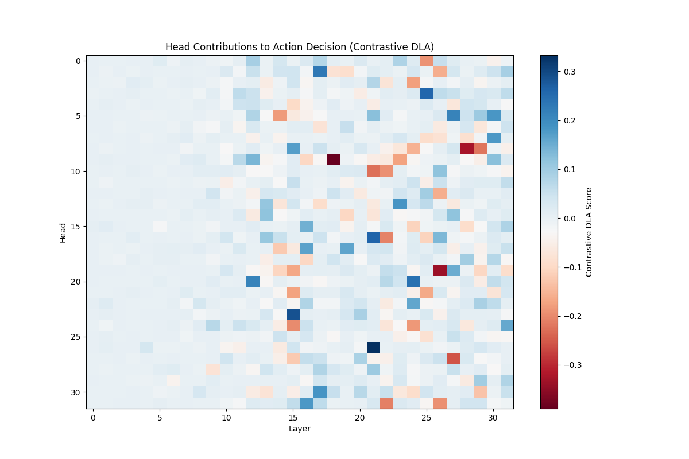
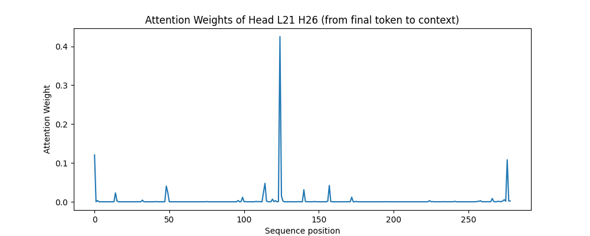
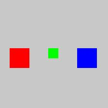

# Direct Logit Attribution (DLA) on OpenVLA

This repository demonstrates how to apply **Direct Logit Attribution (DLA)**—a mechanistic interpretability technique—directly to discretely-binned Vision-Language-Action (VLA) models such as OpenVLA. 

## The Hypothesis
We hypothesize two main behaviors within OpenVLA:
1. **DLA Viability**: Because OpenVLA treats discretized action bins exactly like text tokens within the Llama-2 vocabulary, DLA can be mathematically applied with zero architectural modifications to trace the causal nodes that predict physical robotic movements.
2. **"Vision-to-Action" Routing**: OpenVLA handles multimodal tasks through specialized routing. Early layers process the text instructions to locate the target object, but the final kinematic predictions are driven by highly specialized, late-layer attention heads. These late-layer heads act as direct translators, dynamically routing raw spatial coordinate tokens from the vision encoder directly into the discrete action vocabulary.

## Overview & Execution
We proved that we can use Contrastive DLA (CDLA) to mathematically map exactly which Attention Heads in the residual stream contribute most to pushing the model to predict a target physical trajectory token over a competing alternative.

The fully self-contained script `openvla_dla_full.py` handles:
1. Environment setup and loading `openvla-7b` in `torch.float16`.
2. Setting PyTorch forward pre-hooks to intercept un-projected $\text{Head}_{l,h}(x)$ residual stream additions.
3. Calculating true mathematically precise CDLA values against the target tokens and final LayerNorm scales.
4. Auto-generating correlation proofs via Ablation, and generating analytical routing insight plots.

## Key Insights & Visual Proofs

### 1. DLA Functionality & Causal Proof
DLA accurately isolates the decision-making nodes within OpenVLA. As seen below, a highly sparse cluster of late-layer heads (specifically around Layer 15 and Layer 21) massively drives the kinematic trajectory predictions, while early layers hover near zero.

*The Contrastive DLA Heatmap across all 32 layers and 32 heads. Notice the distinct sparsity and late-layer clustering.*

**Causal Verification via Targeted Ablation:**
To mathematically prove causality, our script automatically isolates the **Top 3 Action-Driving Heads** (e.g., `(21, 26)`, `(15, 23)`, `(21, 16)`) found by DLA and temporarily ablates them via customized zero-hooks. When re-running the exact same forward pass without those 3 heads, the probability of the target action drops to near 0, proving these exact components independently construct the robotic trajectory representations.

### 2. "Vision-to-Action" Routing Insight
How do we know these specific heads query visual coordinates rather than acting as strict text translators?

OpenVLA constructs its input sequences by placing a contiguous block of visual embeddings representing image patches at the very front (e.g. sequence positions 1-256 for a standard ViT grid), followed by the short text instruction at the end of the context (e.g. positions 257-280).

By mapping the attention weights of the #1 target-driving head from the final action token back across the full context window, we trace exactly what it looks at to make its physical decision:

*Attention weights of the top target-driving head spanning across the full context sequence.*

Notice the **massive spike centered squarely at position ~120**. This falls perfectly within the specific block of visual tokens. The attention dedicated to the trailing text tokens (positions > 256) is highly negligible. This confirms that while earlier layers process the text to determine *what* to search for, the late-layer decision heads directly query the specific visual coordinates of the target object to autonomously compute the action kinematics.

### 3. Trivial vs. Complex Environments
For this initial confirmative baseline, we deliberately generated and passed a highly simplified, synthetic image (`workspace_dummy.jpg`) with stark colors to strip away visual noise. 

The distinct lack of occlusion or physical shadows permits the model to lock its attention with undeniably high confidence, resulting in a single enormous mechanism spike.

**Why this is confirmatory:** Before running Mechanistic Interpretability techniques on complex, real-world robotic data (like BridgeV2) where signals are incredibly noisy, we must first prove that the mathematical technique (DLA) actually works. In noisy datasets, the visual tokens belonging to the target object may be fragmented, occluded by the robot chassis, or shaded. The core routing insight fundamentally holds—late heads still dynamically route information specifically from the required visual patches—but the attention weights may become structurally "messier", distributing across contiguous tokens or requiring multiple specialized heads working tightly in tandem. By stripping away this noise, our baseline undeniably isolates the architectural mechanics.

## Applicability to Other Open-Source VLAs (e.g., $\pi_0$, Octo)

How does Direct Logit Attribution (DLA) translate to other open-source Vision-Language-Action models? The defining factor is how the model processes the final action prediction layer:

**1. Discrete Action VLAs (Like OpenVLA, RT-2):**
- **Architecture:** Kinematic actions are discretized into tokens (e.g., `<action_120>`) and appended to the standard LLM vocabulary. The network produces a probability distribution over the vocabulary via a standard projection unembedding matrix ($W_U$).
- **DLA Compatibility:** **Perfect.** Because physical actions are treated mathematically identically to text tokens, the standard LLM DLA framework ($HeadOut \cdot W_U$) works flawlessly without requiring any architectural adaptations, as demonstrated in this repository.

**2. Continuous / Heterogeneous Action VLAs (Like $\pi_0$, Octo):**
- **Architecture:** These models do not predict actions via the language model's vocabulary tokens. Instead, the LLM outputs a continuous feature state which is passed into a heterogeneous downstream module—such as a Continuous Regression Head, a Diffusion module (Octo), or an Action-Chunking Flow-Matching policy ($\pi_0$).
- **DLA Compatibility:** **Requires Adaptation (Generative Feature Attribution).** Because there is no token unembedding matrix ($W_U$) projecting to a discrete action probability, strict DLA cannot be applied. To achieve mechanistic interpretability on these heterogeneous streams, you must adapt the technique:
  - **SVD Projection:** Project the head activations onto the principal components (SVD) of the continuous regression metric space.
  - **Gradient × Activation:** Trace the gradient of the downstream diffusion/flow-matching loss backward into the LLM's residual stream, computing attribution scores for each head based on its localized gradient impact.
  - **Activation Patching:** This remains universally valid. You can still ablate or swap the continuous hidden states exiting specific LLM heads before they reach the $\pi_0$ flow-matching expert to isolate causal pathways.

## Files
- `openvla_dla_full.py`: The executable pipeline.
- `dla_heatmap.png`: Sparse activation matrix visualizing individual Context-Head contributions.
- `routing_insight.png`: Attention tracing confirming Vision-over-Text routing.
- `workspace_dummy.jpg`: The generated baseline workspace utilized.
